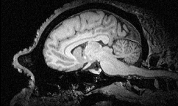
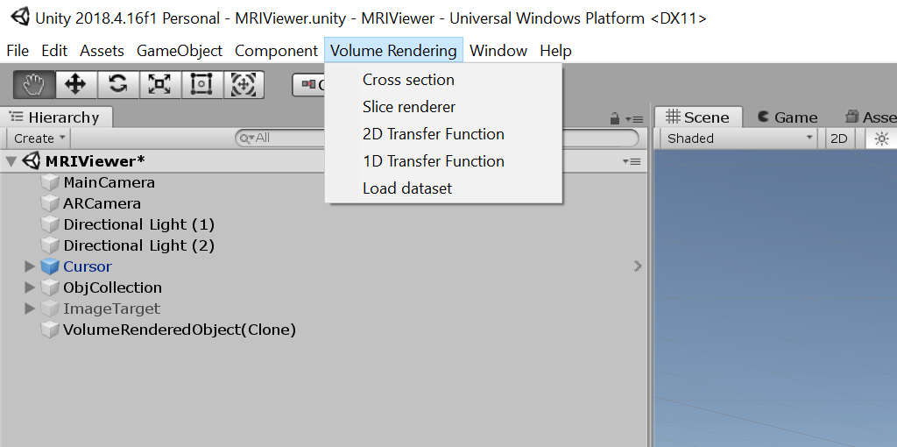

# Augmented Reality Comparative Anatomy MRI Brain Scan Viewer
                                                    Final Project

                                                     Jody Smith
                                                Vanderbilt University
                                             CS8395 - Augmented Reality
                                                    Spring 2020

                                    MRIViewer showing MRI human brain scan

## Description

This repository contains the Unity project folders and C# Scripts for the realization of an augmented reality demonstration that uses a handheld physical planar target to peer into an MRI brain scan projected onto the target with a 3D graphical display of a generic brain for gross orientation.  The goal of the project is to research better tangible interfaces for viewers of medical images in virtual/augmented reality (XR) environment.  The desire is to enable medical personnel or students to investigate MRI brain scans within a collaborative visual augmented environment using innate senses without having much training with the interface.  

The project uses Unity (version 2018.4.16f1 - 64-bit), Unity plugin Vuforia (version 8.6.7), Visual Studio 2019, and Slicer3D (version 4.11.0).  Slicer3D is used to preprocess MRI brain scans into surface polygon models.  The polygon model is then displayed within Unity and subsequently within a Microsoft HoloLens I as the surrogate "hologram" for reference.  A raw 3D array of image data is feed into the Unity executable to display one 2D image slice at a time.  The slice to display is determined by the relative location of a physical planar card or target board that is tracked using Vuforia. By moving the target to different orientations around the surrogate display, different image slices are displayed on the target board.

                                    MRIViewer showing polygonal model of surrogate human brain

## Background and Rational

There are many methods and tools to view 3D imaging data.  When precise measurements are desired, rectified 2D images are typically viewed because we have a hard time thinking of three analytical variables changing at once.  In a similar way, we typically use 2D plots versus 3D in most analytical discussions.  However, we live in a 3D world and our sensory systems process 3D spatial data all the time.  This innate human ability is a major rational and interest in virtual and augmented reality.  If any analytical data, be it spatial or not, is placed into a 3D visual manifestation such that our sensory systems can process it, there is a hope we can gain different perceptions and insights that we normally would not. The trick is to identify those human interfaces that best ensight our innate senses to function at their best.

Brain image scans are typically manipulated for viewing using standard orthogonal views - axial, coronal, and saggital.  However as compute capabilities (and imaging resolutions) have improved so dramaticallly, three dimensional data sets are widely available with high enough spatial resolution to visualize (and process) in volume form.  With this data availability, new analytical methods are continually being invented to not only garner 3D phenomenology but allow the visualization of that phenomenology.  Our ability to view that data on 2D displays has never been sufficient to make use of our 3D innate senses, and the human control interfaces are not optimal either.  Three dimensional spatial data displays are needed with human control interfaces that are intuitive to use but not physically taxing.

                                       Human brain 7T MRI scan shown in Slicer3D

                                       Chimpanzee brain MRI scan shown in Slicer3D

# Approach

Many ideas and designs have been created for manipulating and viewing 3D data in virtual/augmented reality (XR).  As yet no single one has been deemed universally the best for all people and all data (probably never will), but capabilites are improving.  An interface characteristic that many think is necessary is haptic or tangible feedback.  In augmented reality this can be in the form of a physical object that has visual images displayed over it, such as a physical computer keyboard with a different alphabet synthetically displayed on top.

For this effort several ideas where contemplated.  An initial idea was to obtain a physical model of plastic or glass to serve as a target brain surrogate and then display the image volume occulting it.  A pointer or gaze cursor could then be used to select anatomical locations that could be shown as zoomed 2D images.  After deliberation it was decided that the selection of the 2D plane of interest would require many more on-screen controls to be practical.  Another idea was to use a clear acrylic or glass sphere the size of a typical earth globe that would have fiducials to identify its orientation but allow a 3D display of the brain data within the sphere using an AR head mounted display.  A virtual 2D portal into the graphical brain along the sight direction of the user would allow a more natural viewiong of 2D cross-section images.  The sphere could be turned by the user's hands and the 3D display rotate accordingly via tracking of the spheres fiducials.  This approach was deemed the best but due to time, material, and quarantine conditions (COVID-19, April 2020) not allowing fabrication ability, it would have to wait until another day.  The approach attempted for this task was to use a generic 3D visual model of the brain as depicted in the first approach; however, a physical planar target held in the users hand would be placed at differing orientations upon the graphical surrogate and the unique image data slice display on the target.  The planar target would have fiducial markings for tracking and orientation that would not interfere with the images.

Anonymized MRI brain scans were acquired from another laboratory at Vanderbilt University at processed in Slice3D to create 3D surface polygonal models.  These polygonal brain models were further reduced in detail for memory size and file converted (.obj) using 3D Builder within Microsoft Windows 10. The Unity C# script "Sphere Collider" in the scene provides the physics to determinae when the planar target is in contact with the surrogate.  The target image was created using ArUCo symbols around the perimeter with a blank area in the middle for view images.  The MRI brain scan data is loaded in raw form into the Unity project as a three dimensional array.  The 3D image data is viewed in volume form encompassing the polygonal surrogate model.  Also the 3D image array is also used to create 2D slices.  Currently only orthogonal 2D slices are created (axial, saggital, and coronal).  The 2D slices are textured onto the plane view within the graphical scene.

                                                     ArUCo image target

                                                 2D image slices of MRI data

   

 
 

# Software Development

The base framework used for development was Unity (version 2018.4.16f1 - 64-bit). The Unity plugin Vuforia (version 8.6.7) engine is used for the image target that is used for viewing 2D image slices.  The target viewing device is the Microsoft HoloLens I.  Volume rendering scripts from Matias Lavik's volume rendering software (mlavik1/UnityVolumeRendering) were adapted to load in the raw MRI brain scan images and to display actual volume rendering of that data as well.  Unity editor scripts modify the menu allowing for the input of this data.

                        Volume rendering capability adapted from mlavik1/UnityVolumeRendering

                                          Volume rendering editor menu

A cursor keyed by the viewers gaze direction was added using scripts borrowed from the Microsoft tutorial "MR Basics 101".  The cursor could be used for identifying points of interest; however, for this project the gaze direction is only used to determine when/where to display the 2D slices.

An occlusion portal was added in unity to turn off the surrogate graphics when the 2D image slices are being viewed.  This was a result of only object level culling in the graphics.  For future work true cross-sectional slices would be much better. However the actual images should still be displayed versus render derived ones.

                              Human coronal slice view from within MRIViewer

                              Chimpanzee saggital slice view in MRIViewer (with and without surrogate)

                     Volume rendered skin ray trace with surrogate brain polygonal model in Unity

# Acknowledgments

Volume rendering scripts obtained from Matias Lavik:
[https://github.com/mlavik1/UnityVolumeRendering]

Process ideas and Slicer3D hints obtained from Andreas Jakl:
[https://www.andreasjakl.com/visualising-mri-ct-scans-in-mixed-reality-vr-ar-part-1-importing-data/]

Chimpanzee MRI scans obtained from:
[https://www.chimpanzeebrain.org/]
